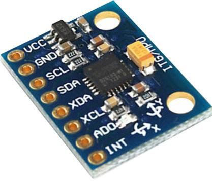

c++ [ROS](http://www.ros.org/) node wrapper for the [mpu6050](http://www.invensense.com/products/motion-tracking/6-axis/mpu-6050/) gyroscope / accelerometer.



Publishes [sensor_msgs::IMU](http://docs.ros.org/api/sensor_msgs/html/msg/Imu.html) messages at 10Hz to `/mpu6050` topic. 
Specifically populates `angular_velocity` & `linear_acceleration`.

on rasp pi 2 uses ~1% cpu and <1% mem

````
rostopic echo /mpu6050
---
header:  
seq: 87
  stamp: 
    secs: 0
    nsecs: 0
  frame_id: ''
orientation: 
  x: 0.0
  y: 0.0
  z: 0.0
  w: 0.0
orientation_covariance: [0.0, 0.0, 0.0, 0.0, 0.0, 0.0, 0.0, 0.0, 0.0]
angular_velocity: 
  x: -2.27480912209
  y: 0.618320584297
  z: -0.648854970932
angular_velocity_covariance: [0.0, 0.0, 0.0, 0.0, 0.0, 0.0, 0.0, 0.0, 0.0]
linear_acceleration: 
  x: 0.0751953125
  y: -0.05419921875
  z: 1.01928710938
---
````		    

TODOS
* no tf support at all, at very least some kind of zeroing service call would be nice... (also set frame_id)
* no handling of sensor noise (though perhaps better to include directly in filter using this for tracking actual rover)
* populate covariance values. 
